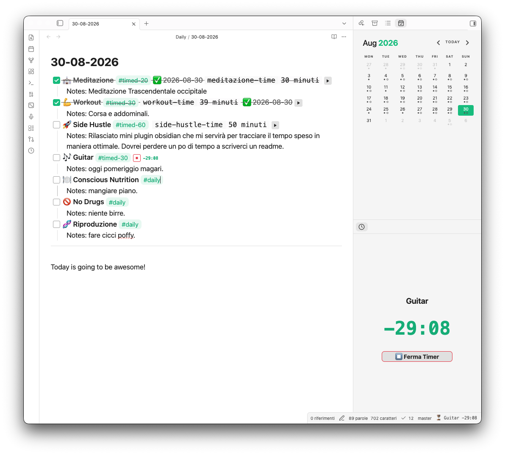
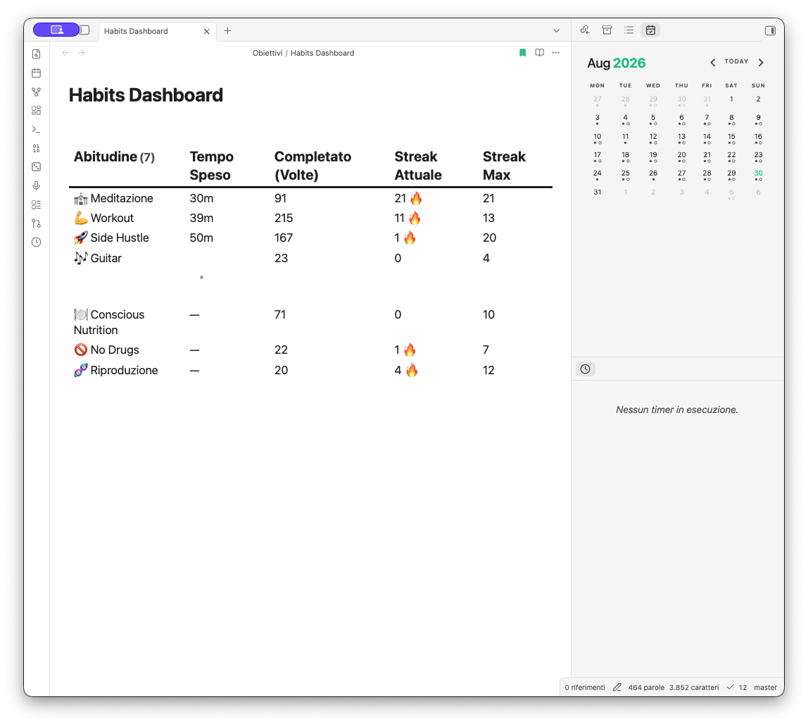

# Daily Template Time Tracker

A custom Obsidian plugin to seamlessly track time spent on daily habits directly from your daily notes.

## Features

- **Inline Timers**: Adds a play/stop button right next to your tasks tagged with `#timed`.
- **Target Countdowns & Auto-Check**: Use `#timed-20` to set a 20-minute goal. The timer will show a countdown and automatically check the box (`- [x]`) when the goal is reached. Overtime is tracked automatically.
- **Sidebar Panel**: Keep track of your active timer in a dedicated sidebar view with a large countdown.
- **Dataview Integration**: Automatically writes the elapsed time (e.g., `[reading-time:: 30m 20s]`) for easy dashboard aggregation, streaks, and check counts.

## Prerequisites

While this plugin works standalone for tracking time, to fully utilize the data and build robust dashboards, you should set up the following:
- **Daily Notes & Templates** (Obsidian Core Plugins): Ensure these are enabled in your core settings. Configure the Daily Notes plugin to use your template file so new daily notes are automatically generated with your habits checklist.
- **[Dataview](https://github.com/blacksmithgu/obsidian-dataview)** (Community Plugin): Required to parse the inline time fields and build the habits dashboard. Make sure to enable JavaScript queries in Dataview settings if you plan to use DataviewJS.
- **[Tasks](https://github.com/obsidian-tasks-group/obsidian-tasks)** (Community Plugin): Highly recommended for querying and organizing your TODOs across different daily notes and projects.

## Installation

Since this plugin is not yet available in the official Obsidian Community Plugins directory, you can install it manually or via BRAT.

### Option 1: Using BRAT (Recommended)
1. Install the **[BRAT](https://github.com/TfTHacker/obsidian42-brat)** plugin from the Obsidian Community Plugins.
2. Enable BRAT in your settings.
3. Open the command palette (`Ctrl/Cmd + P`) and run **BRAT: Add a beta plugin for testing**.
4. Paste the URL of this repository: `https://github.com/GaetanoPiazzolla/daily-template-time-tracker`
5. Enable the plugin in your Community Plugins settings.

### Option 2: Manual Installation
1. Go to the [Releases](https://github.com/GaetanoPiazzolla/daily-template-time-tracker/releases) page of this repository.
2. Download `main.js`, `manifest.json`, and `styles.css` from the latest release.
3. In your Obsidian vault, navigate to the `.obsidian/plugins/` folder and create a new folder named `daily-template-time-tracker`.
4. Move the three downloaded files into that folder.
5. Reload Obsidian (or click the reload button in the Community Plugins tab) and enable **Daily Template Time Tracker**.

## How to Use

### 1. Set up your Daily Template
Create a checklist for your habits in your daily template file. Add the tag `#timed` to any habit you want to track time for. If you have a specific time goal (e.g., 30 minutes), use `#timed-30`. For habits that don't need time tracking, just use a standard tag like `#daily`.

```markdown
- [ ] 📖 **Reading** #timed-20
- [ ] 🏋️ **Exercise** #timed-30
- [ ] 💻 **Deep Work** #timed-60
- [ ] 🎸 **Practice Instrument** #timed-30
- [ ] 💧 **Drink Water** #daily
```

*Every time you create a new daily note using this template, your fresh habits list will be ready to go.*

### 2. Track your Time
When you open a note with these tasks in **Live Preview**, a ▶️ button will appear next to the `#timed` tags. 
- Click ▶️ to start tracking.
- The sidebar panel will automatically update to show your active session.
- Click ⏹️ to stop. The plugin will append a Dataview inline field (like `[deep-work-time:: 30m 22s]`) to the line.



### 3. Build your Dashboard
The true power of this format is querying it with Dataview. You can build a dashboard that calculates your total time spent, completion counts, and streaks (current and max) for *all* habits.




### 4. Advanced TODO Queries
By leveraging the **Tasks** plugin, you can easily pull active TODOs from your daily notes and organize them dynamically by category (e.g., `#home`, `#work`) into a master dashboard.
