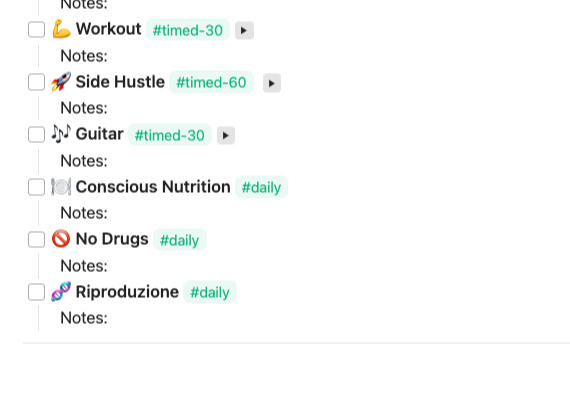
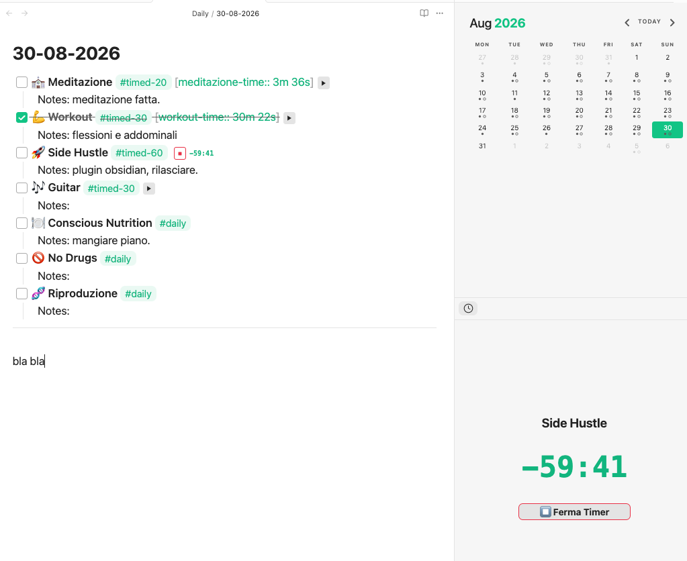
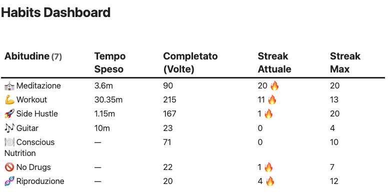

# Daily Template Time Tracker

A custom Obsidian plugin to seamlessly track time spent on daily habits directly from your daily notes. 

## Features

- **Inline Timers**: Adds a play/stop button right next to your tasks tagged with `#timed`.
- **Target Countdowns & Auto-Check**: Use `#timed-20` to set a 20-minute goal. The timer will show a countdown and automatically check the box (`- [x]`) when the goal is reached. Overtime is tracked automatically.
- **Sidebar Panel**: Keep track of your active timer in a dedicated sidebar view with a large countdown.
- **Dataview Integration**: Automatically writes the elapsed time (e.g., `[meditazione-time:: 30m 20s]`) for easy dashboard aggregation, streaks, and check counts.

## Prerequisites

While this plugin works standalone for tracking time, to fully utilize the data and build dashboards, you must install:
- **[Dataview](https://github.com/blacksmithgu/obsidian-dataview)** (Community Plugin): Required to parse the inline time fields and build the habits dashboard. Make sure to enable JavaScript queries in Dataview settings if you plan to use DataviewJS.

## How to Use

### 1. Set up your Daily Template
Create a checklist for your habits in your daily template. Add the tag `#timed` to any habit you want to track time for. If you have a specific time goal (e.g., 30 minutes), use `#timed-30`. For habits that don't need time tracking, just use a standard tag like `#daily`.



```markdown
- [ ] ⛪ **Meditazione** #timed-20
- [ ] 💪 **Workout** #timed-30
- [ ] 🚀 **Side Hustle** #timed-60
- [ ] 🎶 **Guitar** #timed-30
- [ ] 🍽️ **Conscious Nutrition** #daily
```

### 2. Track your Time
When you open a note with these tasks in **Live Preview**, a ▶️ button will appear next to the `#timed` tags. 
- Click ▶️ to start tracking.
- The sidebar panel will automatically update to show your active session.
- Click ⏹️ to stop. The plugin will append a Dataview inline field (like `[workout-time:: 30m 22s]`) to the line.



### 3. Build your Dashboard
The true power of this format is querying it with Dataview. You can build a dashboard that calculates your total time spent, completion counts, and streaks (current and max) for *all* habits.



*Note: For the cleanest look in your notes, we recommend going to **Settings > Dataview** and turning OFF "Enable Inline Field Highlighting". This keeps your time fields looking like regular text.*
